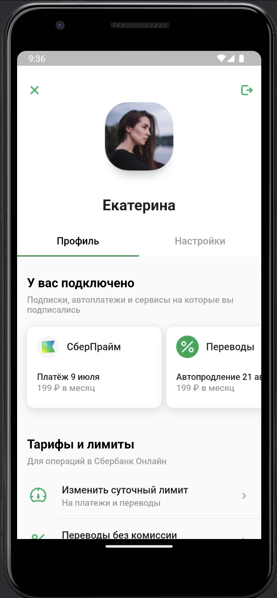
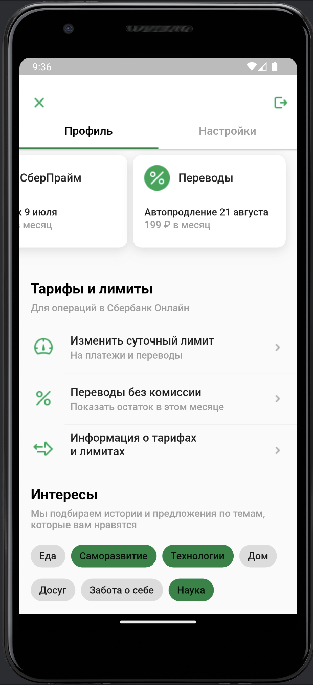

# Bank App Screen for Effective. Lab №1, Flutter.

## How to run

* Clone this project
* Run Android Studio (at least Giraffe)
* Tap button "Run 'app'"

## VERSIONS

* Flutter 3.13.7 • channel stable
* Framework • revision 2f708eb839
* Engine • revision a794cf2681
### Tools 
* Dart 3.1.3 • DevTools 2.25.0

## Screenshots app
|                      Screenshots                       |
|:------------------------------------------------------:|
|   | 
|  |
